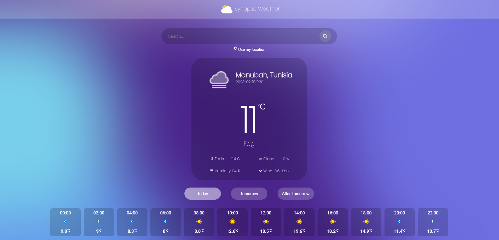

# Weather App Overview

A simple weather application developed with Angular 15.

For the UI I used 
  - Angular Material
  - Scss 
  

## API 

I used the forcast api from [weatherapi.com](https://www.weatherapi.com/)

## How it works

- By default the app use the location of the user to display the weather forecast.

- Once the user start searching for a city it will be stored in the localstorage.

- By clicking on "use my location" the app will delete the city stored and use his location again.

- The application could provide the forcast of 3 days.

- The main card has the current weather.
- The small cards has the weather by time.
- When you click on one of the small cards it will show you the details of the weather at the selected time.
- You can check the weather of the 2 next days by clicking on the buttons " Tomorrow"" and "After Tomorrow"

## How to test it 

- Clone the project 
- Run ``ng serve`` 

Happy Testing !
